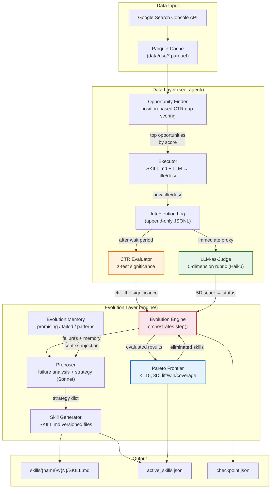
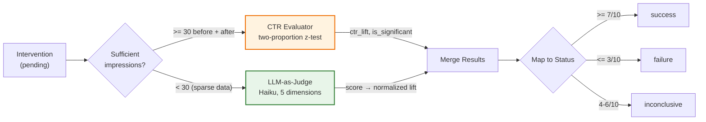
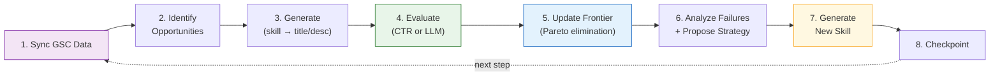

# System Architecture

## Self-Evolving SEO Agent: Architecture Overview

## Dual Evaluation Path

The system's key innovation: two evaluation paths that enable evolution even with sparse real-world data.

## Evolution Loop (Single Step)

