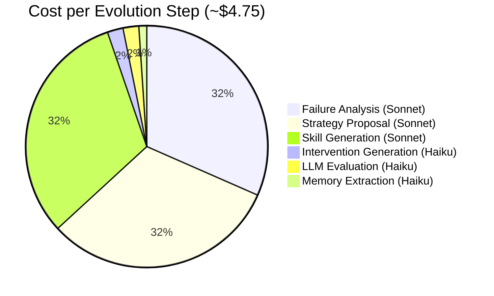

# Cost Analysis

## Per-Step Breakdown

| Component | Model | $/step | Total (10 steps) |
|-----------|-------|-------:|------------------:|
| Intervention generation | Haiku ($1/$5 per M tokens) | $0.10 | $1.00 |
| LLM evaluation | Haiku | $0.05 | $0.50 |
| Failure analysis | Sonnet ($3/$15 per M tokens) | $1.50 | $15.00 |
| Strategy proposal | Sonnet | $1.50 | $15.00 |
| Memory extraction | Haiku | $0.10 | $1.00 |
| Skill generation | Sonnet | $1.50 | $15.00 |
| **Total** | | **$4.75** | **$47.50** |

## What $47.50 Produced

- 10 evolution steps
- 18 new skills (from 7 seeds)
- 35 total skill versions
- ~94 LLM evaluations
- 1 validated top strategy (curiosity_gap: win_rate=0.80)
- Automatic discovery of branded query insight

## vs Commercial SEO Tools

| Solution | Monthly Cost | What You Get |
|----------|------------:|--------------|
| Ahrefs | $99/mo | Keyword data, no auto-optimization |
| SEMrush | $119/mo | Audits, no title generation |
| Surfer SEO | $89/mo | Content optimization, manual workflow |
| **Our Agent** | **$4.75/step** | **Auto-evolving title optimization** |

Key difference: Commercial tools provide data and recommendations. Our agent **acts autonomously** -- it identifies opportunities, generates optimized titles, evaluates results, and evolves its own strategies. The human cost is zero after initial setup.

## Scaling Projections

| Site Traffic | Steps/month | Monthly Cost | Expected Value |
|-------------|------------:|------------:|----------------|
| Low (~100 imp/day) | 4 | $19 | Proxy evaluation only |
| Medium (~1K imp/day) | 8 | $38 | Mixed CTR + proxy |
| High (~10K imp/day) | 15 | $71 | Full CTR evaluation |

At medium traffic, the agent pays for itself if it improves CTR by even 0.1% on pages with commercial intent.
